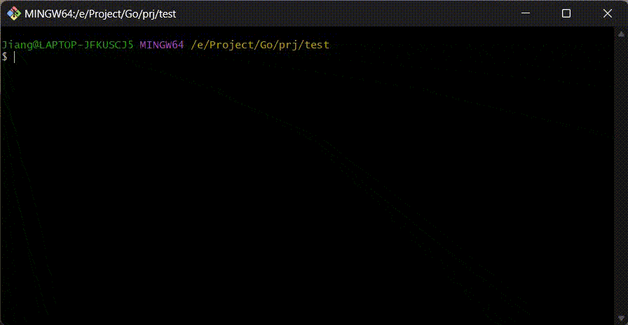

# golang 服务端代码生成工具

这是一个代码生成工具，它的核心理念是基于test/template解析。这款工具专为快速开发而设计，使开发者能够根据预设模板自动生成代码，从而节省大量时间。



## 功能

1、工具内置了对gin、echo、fiber和hertz四大主流Go语言Web框架的支持。

2、利用test/template技术，用户可以自定义模板，从而实现高度定制化的代码生成。

3、该工具还支持生成TypeScript客户端代码，实现全栈开发。


## 编译

```bash
git clone https://gitee.com/giteejiangzhaofeng/go-server-gen.git
cd go-server-gen
sh install.sh
```


## 使用

- 新建项目
```bash
mkdir my-project && cd my-project
gsg new my-project --server gin --log zap
go mod tidy
```


- 增删改查

```
# 生成对user增删改查接口的配置文件
gsg crud user --prefix /api
```


- 代码生成

```bash
gsg update user.yaml
```

默认服务端模板：[layout.yaml](conf/layout.yaml)

默认ts模板：[ts-fetch.yaml](conf/ts-fetch.yaml)


Flags参数说明
```
    --force             force write
-h, --help              get help
-i, --idl      string   idl config path
    --layout   string   layout template path
    --log      string   log type: zap, zero, slog (default "zap")
-o, --output   string   output directory (default current)
-s, --server   string   server type: gin, echo, fiber, hertz (default "gin")
-p, --prefix   string   crud router prefix
```


## 原理


配置解析: 工具首先读取配置文件，将其中定义的接口信息（如路径、方法、参数等）解析并存储到结构体中。

模板解析: 结构体被用作模板的输入数据。通过使用Go语言的text/template包，工具能够根据结构体的内容动态生成代码。

生成代码: 一旦模板与结构体数据结合，工具将生成相应的代码文件。


（注：配置文件通过embed注入到二进制执行文件中，更多请参考 
[template](https://pkg.go.dev/text/template) 和
[embed](https://pkg.go.dev/embed)）


